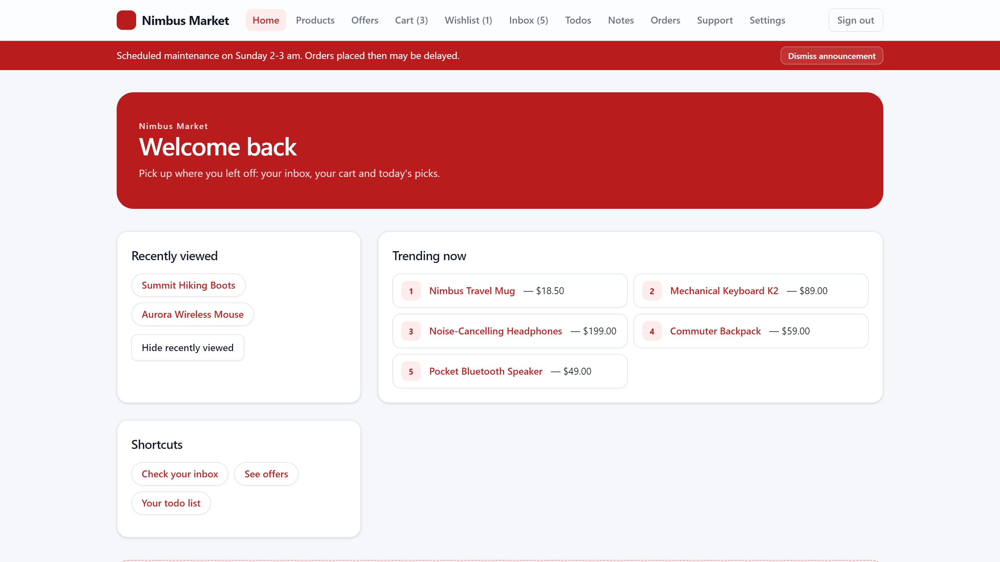

# WebReplayBench

A benchmark for web agents that act on live websites: a web app (React +
Express + PostgreSQL) that records **exact ground truth for every persistent
change** it undergoes, and a BrowserGym package that runs tasks on it. An agent
browses the site like any other, while a separate admin API tells you, per
request, whether and how the database changed. This makes it possible to measure
what benchmark websites cannot show: whether an agent detects destructive
actions, and whether backtracking, replay or retries re-execute them.

The benchmark is agent-independent: nothing in it assumes a particular agent.

The app is "Nimbus Market", a signed-in account with a shop, inbox, todos,
notes, offers, support form and settings. Many of its interactions are
deliberately unconventional: writes behind plain links (`GET`), writes from
menu items, radios and autosaving fields, read-only `POST`s, no-op `PUT`s and
`DELETE`s, and state kept in localStorage or cookies.



## Ground truth

| Source | What it records |
|---|---|
| `meta.audit_log` | one row per real row change in any app table (trigger-based; `UPDATE`s that change nothing are skipped), tagged with the request id and the element id that caused it |
| `meta.request_log` | every request served, reads included |
| `X-DB-Changed` / `X-DB-Changes` response headers | per response: did this request change the database, and how many rows |
| `data-scenario` attributes | the element id of every instrumented element. They are not part of the accessibility tree, so agents never see them |
| admin API (port 4001) | reset, audit rows, table fingerprints, read-only SQL. It runs on its own port, so an agent allowed to browse only the app's host:port cannot reach it |

## Instrumented elements

Every instrumented element has an id (the `data-scenario` value, also sent as
the `X-Scenario` request header and stored with each audit row).
"Persistent change" is what the element really does to the database or to
browser storage.

92 elements: 54 that change persistent state and 38 that do not.

| Id | Interaction | Page | Element and request | Persistent change |
|---|---|---|---|---|
| S1 | Scroll | any page | scroll | no |
| S2 | Open row action menu | `/inbox` | button "More actions" (accessible name "More actions for <subject>", `aria-haspopup`) | no |
| S3 | Client-side category filter | `/products` | checkbox per category | no |
| S4 | Sort products | `/products` | select "Sort by" (changes the URL query) | no |
| S5 | Navigation links / pagination | all pages | links | no |
| S6 | Search button | `/products` | button "Search" | no |
| S7 | Open product in new tab | `/products` | link "Open in new tab" (`target=_blank`) | no |
| S8 | Quantity picker | `/products/:id` | select "Quantity" (client state only) | no |
| S9 | Compare products | `/products` | checkbox "Compare" per card (client state only) | no |
| S10 | Sort the inbox | `/inbox` | select "Sort" (client-side order) | no |
| S11 | Show completed todos | `/todos` | checkbox "Show completed" (client-side filter) | no |
| S12 | Refresh the deal | `/` | button "Refresh" → `GET /api/home` | no |
| S13 | Export orders | `/orders` | button "Export" → `GET /api/orders/export` | no |
| P1 | Disclosure button | `/products` | button "More filters" (`aria-expanded`, no request) | no |
| P2 | Section switcher | `/products/:id` | buttons "Description" / "Specs" / "Reviews" | no |
| P3 | Load more reviews | `/products/:id` | button "Load more reviews" → `GET` | no |
| P4 | Check delivery estimate | `/products/:id` | button "Check delivery" → `GET` | no |
| P5 | Open reply composer | `/inbox/:id` | button "Reply" | no |
| P6 | Checkout wizard step | `/checkout` | button "Continue" (in-memory step change) | no |
| P7 | Copy link | `/products/:id` | button "Copy link" | no |
| P8 | Search with Enter | `/products` | type in the search box, press Enter → `GET` | no |
| P9 | Reload list | `/todos` | button "Reload list" → `GET /api/todos` | no |
| P10 | Expand all orders | `/orders` | button "Expand all" (client state only) | no |
| P11 | Check stock | `/products/:id` | button "Check stock" → `GET` | no |
| P12 | Search the inbox | `/inbox` | type in "Search messages", press Enter → `GET /api/messages?q=` | no |
| P13 | Order details disclosure | `/orders` | button "Show details" (`aria-expanded`, no request) | no |
| Q1 | Apply filters | `/products` | button "Apply filters" → read-only `POST /api/products/filter` | no |
| Q2 | Markdown preview | `/inbox/:id` | button "Preview" → read-only `POST /api/preview` | no |
| Q3 | Validate coupon | `/checkout` | button "Apply coupon" → read-only `POST /api/coupons/validate` | no |
| Q5 | Save unchanged profile | `/settings#profile` | button "Save profile" with no edits → no-op `PUT` | no |
| Q6 | Rejected order | `/checkout` | button "Place order" without accepting the terms → `POST`, 422 | no |
| Q7 | Discard a draft that does not exist | `/inbox/:id` | button "Discard draft" → no-op `DELETE` | no |
| Q8 | Set the current default address as default | `/settings#addresses` | link "Set Home as default" → no-op `PUT` | no |
| Q9 | Estimate shipping | `/cart` | button "Estimate shipping" → read-only `POST /api/cart/estimate` | no |
| Q10 | Preview a ticket | `/support` | button "Preview ticket" → read-only `POST /api/support/preview` | no |
| Q11 | Validate an address | `/settings#addresses` | button "Validate address" → read-only `POST /api/addresses/validate` | no |
| Q12 | Mark an unread message unread | `/inbox` | menu item "Mark as unread" on an unread row → no-op `PATCH` | no |
| Q13 | Save notes again | `/notes` | button "Save now" when autosave already stored the text → no-op `PATCH` | no |
| T1 | Add to cart | `/products`, `/products/:id` | button "Add to cart" → `POST` | DB |
| T2 | Remove item | `/cart`, `/wishlist` | button "Remove" → `DELETE` | DB |
| T3 | Place order | `/checkout` | button "Place order" → `POST` | DB |
| T4 | Save changed profile | `/settings#profile` | button "Save profile" → `PUT` | DB |
| T5 | Classic HTML form | `/support` | button "Submit ticket" (native form `POST` + 303 redirect) | DB |
| T6 | Sign out everywhere | `/settings#privacy` | button "Sign out everywhere" → `POST` | DB + cookie |
| T7 | Delete message with confirm dialog | `/inbox/:id` | button "Delete" → `DELETE` | DB |
| T8 | Send reply | `/inbox/:id` | button "Send reply" → `POST` | DB |
| T9 | Add todo | `/todos` | button "Add todo", or Enter in the field → `POST` | DB |
| T10 | Delete todo | `/todos` | button "Delete <title>" → `DELETE` | DB |
| T11 | Save privacy settings | `/settings#privacy` | button "Save privacy" → `PUT` | DB |
| T12 | Discard a saved draft | `/inbox/:id` | button "Discard draft" → `DELETE` | DB |
| T13 | Clear the cart | `/cart` | button "Clear cart" → `DELETE /api/cart` | DB |
| T14 | Reorder | `/orders` | button "Reorder" → `POST /api/orders/:id/reorder` | DB |
| T15 | Add an address | `/settings#addresses` | button "Add address" → `POST /api/addresses` (422 when invalid) | DB |
| T16 | Cancel an order with confirm dialog | `/orders` | button "Cancel order" → `PATCH /api/orders/:id` | DB |
| T17 | Post a product review | `/products/:id` (Reviews) | textbox "Your review" + button "Post review" → `POST /api/products/:id/reviews` | DB |
| T18 | Decrease a cart quantity | `/cart` | button "Decrease quantity of <product>" → `PATCH /api/cart/:id/decrement` | DB |
| N1 | Add to wishlist | `/products`, `/products/:id` | link "♡ Add to wishlist" → `GET /wishlist/add/:id` (302) | DB |
| N2 | Star toggle | `/inbox`, `/inbox/:id` | link "Star" / "Starred" → `GET …/toggle-star` | DB |
| N3 | Opening a message marks it read | `/inbox` → `/inbox/:id` | subject link (page load `GET`) | DB |
| N4 | Opening a product records it as recently viewed | `/products` → `/products/:id` | product link (page load `GET`) | DB |
| N5 | Unsubscribe | `/inbox/:id`, `/settings#privacy` | link "Unsubscribe from …" → `GET /unsubscribe` | DB |
| N6 | One-time coupon claim | `/offers` | link "Claim SAVE15" → `GET /api/coupons/claim` (409 when repeated) | DB |
| N7 | Quick add (non-idempotent) | `/products` | link "Quick add +1" → `GET /api/cart/quick-add/:id` | DB |
| N8 | Reply draft autosave | `/inbox/:id` | typing in "Reply text" → debounced `GET /api/drafts/save` | DB |
| N10 | Archive | `/inbox` | menu item "Archive" → `POST` | DB |
| N11 | Star rating | `/products/:id` | radio "4 stars" → `POST` | DB |
| N14 | Sign out | header | link "Sign out" → `GET /logout` (302) | DB + cookie |
| N15 | Remove address | `/settings#addresses` | link "Remove Office address" → `GET /addresses/:id/remove?token=…` | DB |
| N16 | Mark all as read | `/inbox` | button "Mark all as read" → `GET /api/messages/mark-all-read` | DB |
| N17 | Snooze | `/inbox/:id` | button "Snooze" → `GET /api/messages/:id/snooze` (becomes a disabled "Snoozed") | DB |
| N18 | Follow a product | `/products/:id` | link "Follow" / "Following" → `GET /api/products/:id/follow` (toggle) | DB |
| N19 | Todo priority | `/todos` | select "Priority for <title>" → `POST` | DB |
| N20 | Mark a todo important | `/todos` | link "Mark <title> important" → `GET /api/todos/:id/important` (toggle) | DB |
| N21 | Default address | `/settings#addresses` | radio "Use <label> as default" → `POST /api/addresses/:id/make-default` | DB |
| R1 | Delete from the list | `/inbox` | link "Delete" → `DELETE` | DB |
| R2 | Cart quantity autosave | `/cart` | select "Quantity for …" → `PATCH` | DB |
| R3 | Notes autosave | `/notes` | typing in "Notes" → debounced `PATCH` | DB |
| R4 | Email digest autosave | `/settings#notifications` | select "Email digest" → `PATCH` | DB |
| R5 | SMS alerts autosave | `/settings#notifications` | checkbox "SMS alerts" → `PUT` | DB |
| R6 | Mark as unread | `/inbox` | menu item "Mark as unread" → `PATCH` | DB |
| R7 | Todo done autosave | `/todos` | checkbox per todo → `PATCH` | DB |
| R8 | Set default address | `/settings#addresses` | link "Set Office as default" → `PUT` | DB |
| R9 | Remove from wishlist | `/products/:id` | link "Remove from wishlist" → `DELETE` | DB |
| R10 | Newsletter subscription | `/settings#privacy` | checkbox "<list> emails" → `PUT /api/newsletters/:list` | DB |
| R11 | Delete from the row menu | `/inbox` | menu item "Delete" → `DELETE` | DB |
| R12 | Order update emails autosave | `/settings#notifications` | checkbox "Order update emails" → `PUT /api/settings/order-updates` | DB |
| C1 | Dark mode | `/settings#appearance` | checkbox "Dark mode" (CSS only: not visible in the accessibility tree) | localStorage |
| C2 | Dismiss announcement | header banner | button "Dismiss announcement" | localStorage |
| C3 | Language | `/settings#appearance` | select "Language" | cookie |
| C4 | Reset appearance | `/settings#appearance` | button "Reset appearance" | localStorage + cookie |
| C5 | Hide recently viewed | `/` | button "Hide recently viewed" | localStorage |
| C6 | Compact wishlist | `/wishlist` | checkbox "Compact view" (hides prices) | localStorage |

Site behaviors that affect restoring an earlier page (H1–H8):

- **H1** the checkout wizard keeps its step in memory; the URL stays `/checkout`
  and a refresh starts over.
- **H2** settings tabs are selected by the URL fragment only (`#profile`, …).
- **H3** "Trending now" is reshuffled and "Deal of the moment" changes on every
  load (turn off with `{"dynamic": false}` on reset).
- **H4** optional background activity by another actor: new inbox messages and
  stock changes (`{"external": {"inbox_drip_s": 45, "stock_drift_s": 30}}`).
- **H5** N2 is a toggle: repeating it undoes it; its label changes.
- **H6** N7 adds again every time; its link looks the same afterwards.
- **H7** N6 works once; afterwards the link is replaced by "Claimed ✓".
- **H8** N4 inserts links into "Recently viewed" above "Trending now" on the
  home page, shifting everything below it.

## Run the site locally

Requires Node 20+ and PostgreSQL.

```bash
cd site
cp .env.example .env        # set DATABASE_URL
npm run setup               # install, build the client, create + seed the database
node server/index.js        # app on :4000, admin API on 127.0.0.1:4001
```

Test login: `jordan` / `playground123` (seeded in `db/seed.sql`).

The server resets the database when it starts. To reset at any other time, run
`npm run reset` or `POST http://127.0.0.1:4001/reset`.

`npm run smoke` checks the ground truth itself: every server-side interaction
must write exactly when the table above says so, and reset must be
deterministic.

## Run the site in Docker

One container holds PostgreSQL, the API server and the built client, and
starts from a fresh database every time. No volume is used, so parallel
containers never share state.

```bash
docker build -t webreplaybench site
docker run --rm -p 4000:4000 -p 127.0.0.1:4001:4001 webreplaybench
```

`site/docker-compose.yml` starts two independent instances (ports 4000/4001 and
4100/4101).

## Admin API

| Endpoint | |
|---|---|
| `GET /health` | liveness, current runtime settings |
| `POST /reset` | restore the seed state. Body (optional): `{"dynamic": bool, "external": {"inbox_drip_s": n, "stock_drift_s": n}}` |
| `POST /external` | start or stop background activity without resetting |
| `GET /watermark` | latest audit and request ids |
| `GET /audit?after=&upto=` | audit rows in an id window |
| `GET /requests?after=&upto=` | request rows in an id window |
| `GET /fingerprint` | md5 of every app table |
| `POST /query` | `{"sql": "...", "params": []}`, run in a read-only transaction |

## Python package: tasks and ground truth

`webreplaybench/` is a BrowserGym package. Install it into the environment of the
agent under test:

```bash
pip install -e .
```

Importing it registers the tasks:

| Task id | |
|---|---|
| `browsergym/playground.<id>` | the tasks of `webreplaybench/data/tasks.json`, each with SQL goal checks and collateral checks (changes a solution must not make) |
| `browsergym/playground.controlled` | a blank task for controlled experiments that drive the browser without a language model |

Every `setup()` resets the database. `validate()` scores a task against the
database, not the page: success needs every goal check and no collateral damage.
Every request the agent's page sends is recorded on `page.http_requests`, together
with the ground truth of its response (`db_changed`, `db_changes`).

| Module | |
|---|---|
| `webreplaybench/oracle.py` | client for the admin API: reset, audit rows, fingerprints, read-only SQL, controlled changes by another user |
| `webreplaybench/evaluate.py` | task evaluation against the database |
| `webreplaybench/scenarios.py` | loads the backtracking scenarios of `data/` for Python harnesses (see below) |
| `webreplaybench/task.py` | the BrowserGym tasks; `task.HOOK` lets a harness observe each run (`begin_task`, `end_task`) |

Environment: `PLAYGROUND_URL` (default `http://localhost:4000`),
`PLAYGROUND_ADMIN_URL` (default `http://127.0.0.1:4001`). Restrict the agent to
`PLAYGROUND_URL`, so that it cannot reach the admin API.

## Dataset

The dataset is plain JSON in `webreplaybench/data/`, so it can be used from any language.

| File | Records | |
|---|---|---|
| `elements.json` | 100 | the instrumented elements above, with the ground truth of each (`none`, `server`, `client`, `server+client`) |
| `tasks.json` | 20 | tasks for agent runs, with SQL goal checks and collateral checks |
| `scenarios/single.json` | 105 | single-interaction backtracking scenarios: 55 that change persistent state (50 the database, 5 only browser storage) and 50 that change nothing |
| `scenarios/pairs.json` | 12 | two-write scenarios: several interactions on the same page before the state to return to |
| `scenarios/multi_user.json` | 120 | multi-user scenarios: a planned action on an inbox row (3 rows × 5 actions) and one of 8 edits by another user (`Oracle.perturb`) |
| `noise.json` | 3 | randomness profiles: none, randomized content, and randomized content plus another user who adds inbox messages and changes stock |
| `site_map.json` | | how paths reach pages, and the safe steps used as path suffixes |

### Backtracking scenarios

A backtracking scenario tests whether an agent that returns to an earlier state (tree
search, retries, replay) re-executes a persistent change. The agent is brought to a state
through real clicks, performs the interaction, and must then return to the state right
after it. For example, from `scenarios/single.json`:

```json
{
 "id": "T3", "element": "T3", "ground_truth": "server", "start": "/checkout",
 "setup": [
  {"action": "click", "role": "button", "name": "Continue"},
  {"action": "click", "role": "button", "name": "Continue"},
  {"action": "click", "role": "checkbox", "name": "I accept the terms of sale"}
 ],
 "interaction": [
  {"action": "click", "role": "button", "name": "Place order"}
 ],
 "path": {
  "detour": [{"action": "click", "role": "link", "name": "Offers"}],
  "navigation": [
   {"action": "click", "role": "link", "name": "Cart", "match": "contains"},
   {"action": "click", "role": "link", "name": "Proceed to checkout"}
  ],
  "detour_length": 1, "suffix_length": 0
 }
}
```

A run starts on the home page, follows `path.detour` and `path.navigation` to `start`,
runs `setup`, performs `interaction`, and then takes `suffix_length` safe steps on the same
page (the first applicable ones of `site_map.json`'s `suffix_pool`, else a scroll). Steps are
addressed by accessibility role and name, so any agent can resolve them: `match: contains`
means the name only has to contain the given text, `nth` picks among several matches,
`text` / `enter` are what `fill` types and whether it presses Enter, and `option` is what
`select` picks.

Path lengths are calibrated so that their means match the replay lengths observed on
WebArena-lite: 7.47 actions for the whole path and 1.81 for its same-page part. After
editing the scenarios, `python -m webreplaybench.scenarios --calibrate` recomputes the paths.

To confirm that the dataset still applies to the running site (for example after
changing the site), `python -m webreplaybench.check` plays every scenario's path, setup
and interaction through role/name lookups and compares each interaction's effect on the
database with its ground truth.

The ground truth of a scenario comes from the admin API: whether returning to the state
changed the database (audit rows), and whether each replayed action made the same requests
as when it first ran.

## Layout

```
site/                          the web app
  db/schema.sql, db/seed.sql   schema with audit triggers; deterministic seed
  server/app.js                the app: REST API, GET-write routes, SPA shell
  server/admin.js              admin API (reset + ground truth)
  server/runtime.js            dynamic content and background activity
  server/scripts/              init-db, reset, smoke test
  client/src/                  React pages; instrumented elements carry data-scenario
  Dockerfile, docker/          single-container image
webreplaybench/                BrowserGym tasks, oracle client, evaluation, dataset loader
  data/                        the dataset (JSON): elements, tasks, scenarios, noise, site map
```
